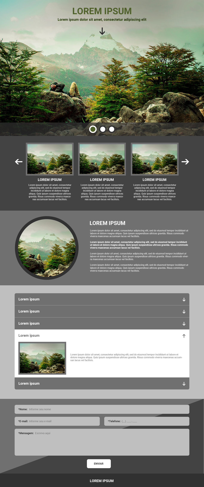
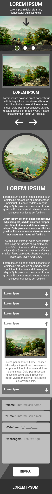

# DOT digital group - FrontEnd Project

Project Developed for the Full Front End position.

## Install Dependencies

**1. Check if you have a recent version of [Node.js](https://nodejs.org/) (which comes bundled with [npm](https://www.npmjs.com/), a JavaScript package manager):**

```bash
$ node -v
```

```bash
$ npm -v
```

**2. In the _project root directory_ install all the dependencies and libs:**

```bash
$ npm install
```

## Start webpack-dev-server

**1. Run the following command:**

```bash
$ npm run start
```

**Or to generate all the bundle:**

```bash
$ npm run build
```

The files will be created in the folder **/dist**.

**2. And then access [http://localhost:8080/](http://localhost:8080/) on your browser (it's setup to open automatically).**


## Objectives:

- Develop the front end of PSD files given;
- The result should be responsive and the mobile version should match the mobile PSD file;

## Observations:

- It is allowed to use jQuery;
- It is not allowed to use CSS framework and pre processors;
- It is not allowed to use JavaScript framework;
- It is not allowed to use Angular, Bootstrap, React, Vue, etc;
- The final content should be functional in the latest and next to last version of major browsers, as well as version 9 of the Internet Explorer browser.

## Functionalities:

- By clicking on the top arrow the screen should scroll to the second section (with dark gray background and slider with images and text);
- The top should contain a slider, where when clicking on one of the three balls, the background image of the top is changed and the clicked ball should be highlighted;
- In the second section (dark gray background with images and text) there should be a slider, containing a total of 9 elements (images and text), being shown only 3 elements at a time on the screen;
- In the third section (gray background with round image and text) the text should be vertically aligned with the image;
- In the fourth section (light gray background) there should be an accordion feature, where initially all elements appear closed and when clicking on one of the elements it expands and its content is shown, according to the item with white background. Only one element should be opened at a time, that is, when clicking on one element, the others must be collapsed. The clicked element must have its colors changed and the arrow should change direction (according to layout);
- In the fifth section (form) the background should contain two colors divided by a triangular shape. The contact form must contain masks and be validated by clicking the "submit" button;
- The footer should include the centered text.

## Differential:

- Animated effects on interactive elements;
- Use task automator (gulp).

# Screenshots

## Desktop Layout:



## Mobile Layout:


